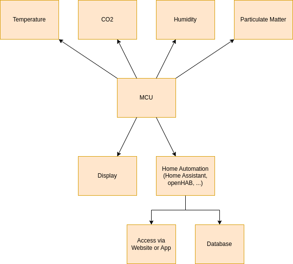

# Ambiainvis

Environmental monitoring to welcome you home. 

A creation from the Romansh words for environment (ambiaint) and welcome (bainvis).

## Overview

## Sensors

### Humidity & Temperature - Si7021

- Interface: I2C
- Humdity Range: 0% - 100%
- Humdity Accuracy (Typical, 0% - 80%): ±2%
- Temperature Range: -40°C - 85°C
- Temperature Accuracy (Typical, -10°C - 85°C): ±0.3°C
- Voltage: 1.9V - 3.6V
- Current: ???

https://www.silabs.com/documents/public/data-sheets/Si7021-A20.pdf

https://aliexpress.com/item/4000074032970.html

### Humidity & Temperature - SHT30-D

- Interface: I2C
- Humdity Range: 0% - 100%
- Humdity Accuracy (Typical, 10% - 90%): ±2%
- Temperature Range: -40°C - 125°C
- Temperature Accuracy (Typical, 0°C - 65°C): ±0.2°C
- Voltage: 2.15V - 5.5V
- Current: ???

https://sensirion.com/products/catalog/SHT30-DIS-B/
https://sensirion.com/media/documents/213E6A3B/63A5A569/Datasheet_SHT3x_DIS.pdf

https://aliexpress.com/item/32700729302.html

### NDIR CO2 - SCD40

- Interface: I2C
- CO2 Range: ???
- CO2 Accuracy: ???
- Voltage: ???
- Current: ???

https://sensirion.com/products/catalog/SCD40/
https://sensirion.com/media/documents/E0F04247/631EF271/CD_DS_SCD40_SCD41_Datasheet_D1.pdf

https://aliexpress.com/item/1005004494206882.html

### CO2 - Senseair S8

- Interface: I2C
- CO2 Range: ???
- CO2 Accuracy: ???
- Voltage: ???
- Current: ???

https://senseair.com/products/size-counts/s8-residential/
https://senseair.com/products/size-counts/s8-2/

https://aliexpress.com/item/32863793412.html

### CO2 - Senseair Sunrise CO2

- Interface: I2C
- CO2 Range: ???
- CO2 Accuracy: ???
- Voltage: ???
- Current: ???

https://senseair.com/products/power-counts/sunlight-co2/

### TVOC/eCO2 - CJMCU-811

https://aliexpress.com/item/1005003829532007.html

- Interface: I2C
- CO2 Range: ???
- CO2 Accuracy: ???
- Voltage: ???
- Current: ???

### Particulate Matter - PMS5003/PMS7003

- Interface: ???
- Accuracy PM2.5: ???
- Voltage: ???
- Current: ???

https://aqicn.org/sensor/pms5003-7003/
https://aqicn.org/air/sensor/spec/pms5003-english-v2.3.pdf
https://aqicn.org/air/sensor/spec/pms7003-english-v2.5.pdf

### ???

## Actors

### NVRAM - AT24C256

- Interface: I2C
- Storage (Bytes): ???
- Voltage: ???
- Current: ???

https://aliexpress.com/item/1005003469549569.html

### Display - SSD1306

- Interface: I2C
- Voltage: ???
- Current: ???

https://cdn-shop.adafruit.com/datasheets/SSD1306.pdf

https://github.com/adafruit/Adafruit_SSD1306

## Abbreviations

| Abbreviation | Description |
| -- | -- |
| TVOC | Total Volatile Organic Compound |
| eCO2 | Equivalent CO2 |
