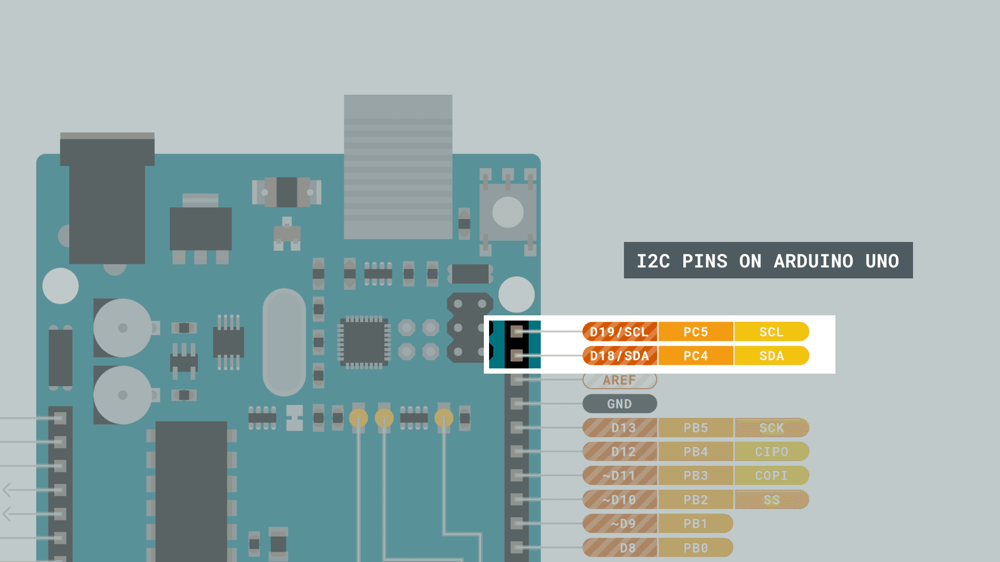
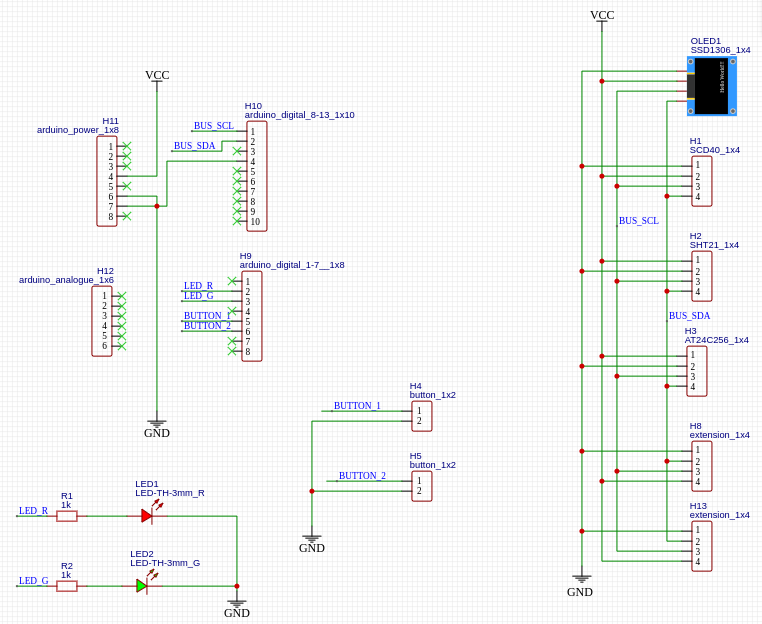
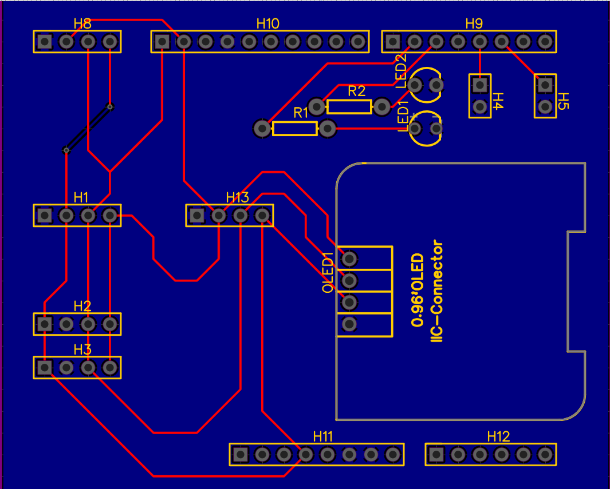

# Ambiainvis

Environmental monitoring to welcome you home.

A creation from the Romansh words for environment (ambiaint) and welcome (bainvis).

## Overview

### block diagram


Block diagram converted to schematics & layout via EasyEDA. 


## Installation

- load [code](#code) onto Arduino
- launch python 
    - optionally check if installed

```
sudo apt install python3
```


## Arduino & I2C

How to [connect](https://docs.arduino.cc/static/5fa18e7fb884a8f6381a54dae4d87551/29114/uno-i2c.png) Arduino Uno to I2C clock (SCL) and data (SDA) wires. 




## component overview

| ID | I2C address | VCC | description |
|----------|----------|----------|----------|
| [AT24C256](#at24c256)   | 0x50 & 0x58   | 2.7 - 5.5 | storage EEPROM   |
| [SCD40](#scd40)   | 0x62  | 2.4 - 5.5 | sensor for CO2    |
| [HTU21_SHT21](#hty21_sht21)   | 0x40   | 3.3-5 | sensor for humidity & temperature  |
| [SSD1306](#display_ssd1306)   | 0x3C   | 3.3 - 5 | display OLED |
<!-- | id   | i2c   | V | descr   | -->


## Abbreviations

| Abbreviation | Description |
| -- | -- |
| TVOC | Total Volatile Organic Compound |
| eCO2 | Equivalent CO2 |
| NDIR | Non-Dispersive Infrared |
| VOC | Volatile Organic Compound |

https://en.wikipedia.org/wiki/Volatile_organic_compound
https://en.wikipedia.org/wiki/Nondispersive_infrared_sensor


## Sensors

### hty21_sht21

SHT21 Humidity & Temperature sensor with 
HTU21 I2C level shifting circuitry to accept 3.3V-5V. 

SHT21 specifications:
- Relative Humdity Range: 0% - 100%
- Relative Humdity Accuracy (Typical, 10% - 90%): ±2%
- Temperature Range: -40°C - 125°C
- Temperature Accuracy (Typical, 5°C - 60°C): ±0.3°C
- Voltage: 2.1V - 3.6V
- Current: 200µA - 300µA

<!-- [name](link) --> 

[catalogue](https://www.sensirion.com/products/catalog/SHT21/)
[datasheet](https://www.sensirion.com/media/documents/120BBE4C/63500094/Sensirion_Datasheet_Humidity_Sensor_SHT21.pdf)
[buy](https://www.aliexpress.com/item/1005005599036502.html?spm=a2g0o.productlist.main.15.26fc3b61qcOIhK&algo_pvid=36068584-1eb0-49a0-acb1-1a0740ca4d86&aem_p4p_detail=202307261228235955719856672000005500547&algo_exp_id=36068584-1eb0-49a0-acb1-1a0740ca4d86-7&pdp_npi=3%40dis%21CHF%211.03%211.03%21%21%211.17%21%21%4021021a7216903997033188158d076c%2112000033701436978%21sea%21CH%210&curPageLogUid=74QUFO1f7zjr&search_p4p_id=202307261228235955719856672000005500547_8)


### scd40

NDIR CO2 sensor

- CO2 Range: 0ppm - 40'000ppm
- CO2 Accuracy (400ppm - 2'000ppm): ±50ppm
- Relative Humdity Range: 0% - 100%
- Relative Humdity Accuracy (Typical, 15°C - 35°C, 20% - 65%): ±6%
- Temperature Range: -10°C - 60°C
- Temperature Accuracy (Typical, 15°C - 35°C): ±0.8°C
- Voltage: 2.4V - 5.5V
- Current (Typical, Periodic, 3.3V): 15mA

https://sensirion.com/products/catalog/SCD40/
https://sensirion.com/media/documents/E0F04247/631EF271/CD_DS_SCD40_SCD41_Datasheet_D1.pdf

https://aliexpress.com/item/1005004494206882.html


### TVOC/eCO2 - CJMCU-811

- Interface: I2C
- CO2 Range: ???
- CO2 Accuracy: ???
- Voltage: ???
- Current: ???

https://aliexpress.com/item/1005003829532007.html


### Particulate Matter - PMS5003/PMS7003

- Interface: ???
- Accuracy PM2.5: ???
- Voltage: ???
- Current: ???

https://aqicn.org/sensor/pms5003-7003/
https://aqicn.org/air/sensor/spec/pms5003-english-v2.3.pdf
https://aqicn.org/air/sensor/spec/pms7003-english-v2.5.pdf

### Ozone - MQ131

### VOC - MP503

### Pressure - MPL3115A2

### Pressure - DPS310


## Actors

### at24c256

NVRAM - AT24C256
- Storage (Bytes): 256 KB

[datasheet](https://pdf1.alldatasheet.com/datasheet-pdf/view/56065/ATMEL/AT24C256.html)
[buy](https://aliexpress.com/item/1005003469549569.html)


### display_ssd1306

[datasheet SBC-OLED01](https://files2.elv.com/public/25/2511/251189/Internet/251189_data_eng.pdf)
[datasheet SSD1306](https://cdn-shop.adafruit.com/datasheets/SSD1306.pdf)


## Environment Values

### CO2

Outside (2023): 420 ppm
Outside (1950): 311 ppm

https://www.volker-quaschning.de/datserv/CO2/index.php

- \< 1'000 ppm: everything fine
- \> 2'000 ppm: fresh air necessary

https://www.umweltbundesamt.de/sites/default/files/medien/pdfs/kohlendioxid_2008.pdf

- \> 30'000 ppm / 30 minutes: intoxication
- \> 70'000 ppm / 2 minutes: unconsciousness
- \> 100'000 ppm: dangerous for life

https://www.cdc.gov/niosh/idlh/124389.html

### Relative Humidity

- 30% - 65%: comfortable for humans
- \> 60%: increased probability for molds
- 40% - 60% & 18°C - 23°C: ideal for wood (floor, furniture, ...), as wood does not contract/expand in this range

https://www.umweltbundesamt.de/sites/default/files/medien/publikation/long/2885.pdf
https://www.umweltbundesamt.de/themen/faq-absenkung-der-raumtemperatur-in-herbst-winter
https://www.venta-air.com/en_de/Usage/Humidity-for-wooden-floors-and-furniture/


## PCB

Circuit diagram and layout were created with [EasyEDA](https://easyeda.com/editor#id=24dbcd1713c245d694e021eeda7a2357|4a071e91d0c34034897f0c1790f9c713). 

### Circuit Diagram



### Layout




## Code

### Arduino

#### get I2C address

``` c
// --------------------------------------
// i2c_get_address.ino
// 
// used to get unique address of i2c device
//
// Version 1
//    This program (or code that looks like it)
//    can be found in many places.
//    For example on the Arduino.cc forum.
//    The original author is not known.
// Version 2, Juni 2012, Using Arduino 1.0.1
//     Adapted to be as simple as possible by Arduino.cc user Krodal
// Version 3, Feb 26  2013
//    V3 by louarnold
// Version 4, March 3, 2013, Using Arduino 1.0.3
//    by Arduino.cc user Krodal.
//    Changes by louarnold removed.
//    Scanning addresses changed from 0...127 to 1...119,
//    according to the i2c scanner by Nick Gammon
//    https://www.gammon.com.au/forum/?id=10896
// Version 5, March 28, 2013
//    As version 4, but address scans now to 127.
//    A sensor seems to use address 120.
// Version 6, November 27, 2015.
//    Added waiting for the Leonardo serial communication.
//
//
// This sketch tests the standard 7-bit addresses
// Devices with higher bit address might not be seen properly.
//

#include "/usr/share/arduino/hardware/arduino/avr/libraries/Wire/src/Wire.h"


void setup() {
  Wire.begin();

  Serial.begin(9600);
  while (!Serial); // Leonardo: wait for Serial Monitor
  Serial.println("\nI2C Scanner");
}

void loop() {
  int nDevices = 0;

  Serial.println("Scanning...");

  for (byte address = 1; address < 127; ++address) {
    // The i2c_scanner uses the return value of
    // the Wire.endTransmission to see if
    // a device did acknowledge to the address.
    Wire.beginTransmission(address);
    byte error = Wire.endTransmission();

    if (error == 0) {
      Serial.print("I2C device found at address 0x");
      if (address < 16) {
        Serial.print("0");
      }
      Serial.print(address, HEX);
      Serial.println("  !");

      ++nDevices;
    } else if (error == 4) {
      Serial.print("Unknown error at address 0x");
      if (address < 16) {
        Serial.print("0");
      }
      Serial.println(address, HEX);
    }
  }
  if (nDevices == 0) {
    Serial.println("No I2C devices found\n");
  } else {
    Serial.println("done\n");
  }
  delay(5000); // Wait 5 seconds for next scan
}
```

### Python
